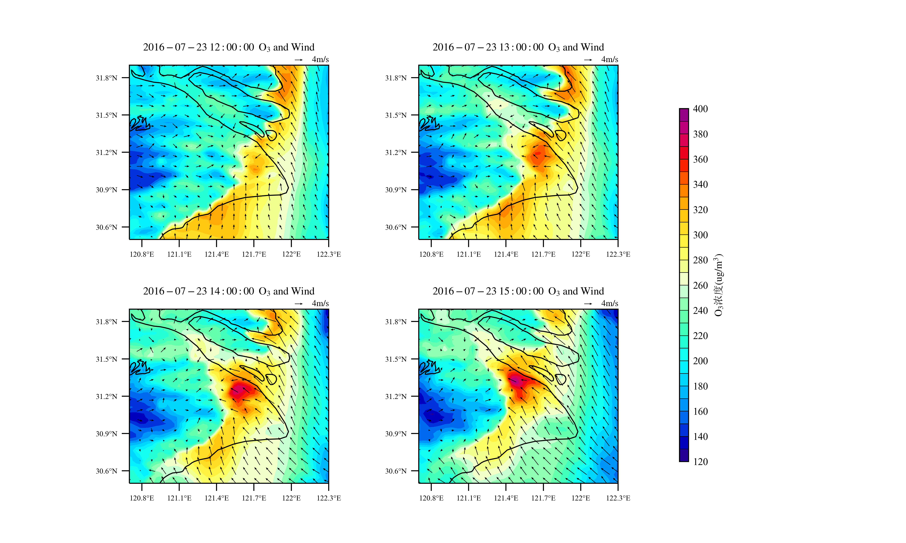
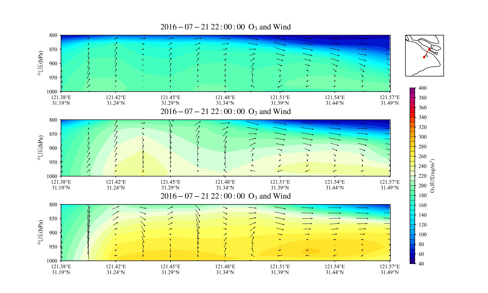

# PyWRF

这个项目用于wrfout文件的后处理，对根目录下的文件夹做解释：
- font：存放字体文件，可以自行更改需要的宋体和Times New Roman，也可以自行添加相关字体文件并对代码进行修改
- lib：存放所有自行编译的功能库，包括绘图、数据处理等
- show：存放一些需要展示的图片

本项目将采用脚本-库的形式，脚本位于根目录下的py文件。使用时仅需要修改脚本的内容即可。

所有自带的脚本都是一个示范作用，其中尽量对每一个变量以及使用方法做了注释，下面对每个脚本的示范功能做解释：

----

##1.read_ncfile_height
这个脚本用于读取wrfout文件的各层海拔高度、离地高度以及气压，修改需要读取的经纬度和文件地址即可

##2.read_ncfile_keys
这个脚本用于读取所有netcdf文件的变量名。num可以修改一行显示多少个变量，主要是为了观看方便。

##3.read_ncfile_time
这个脚本用于读取wrfout文件的所有时间及其序号。

##4.draw_plain
这个文件用于绘制wrfout文件的平面图，可以根据自己的需求绘制单张图片、循环出图或者一张图片中绘制多个子图同时显示。参数都已经进行了注释，如果有不清楚的可以查看lib/Geo_Draw.py进行查看。

脚本绘制的展示图如下：

##5.draw_vertical
这个脚本用于绘制wrfout文件的垂直剖面图，可以根据自己需求添加子图、colorbar、缩略图等信息。参数都已经进行了注释，如果有不清楚可以查看lib/Vert_Draw.py查看。

脚本绘制的展示图如下：

剩余的脚本都是坑，还没填。接下来会更新插值脚本。关于shapefile文件的绘图视情况而定，由于python绘制shapefile过于简单，因此可能不进行脚本与库的编写。最后会慢慢更新垂直剖面场流线图的绘图功能，这是个大坑，因为matplotlib在制作streamplot的时候就没想过气象绘图的需求。